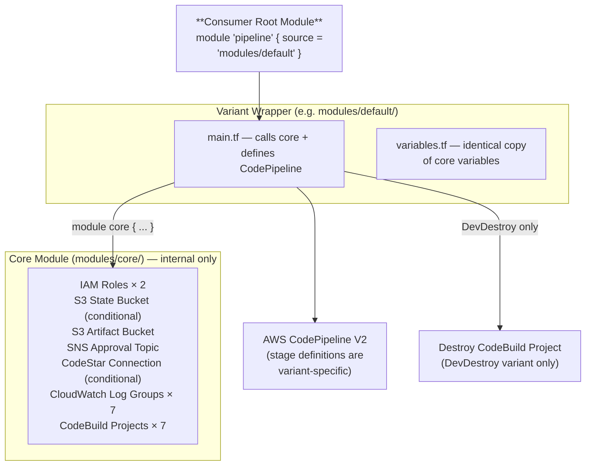
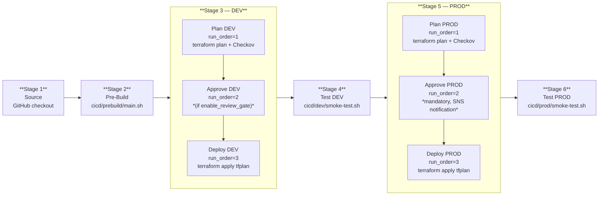
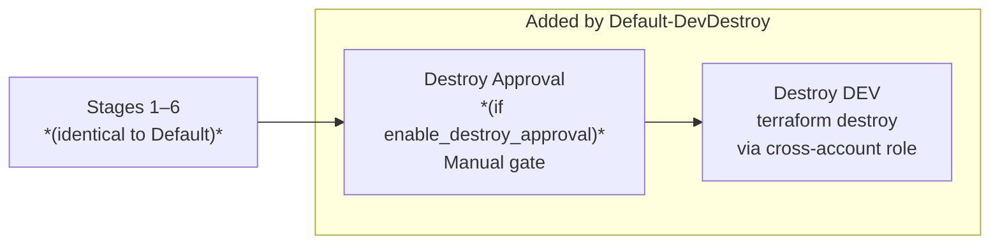
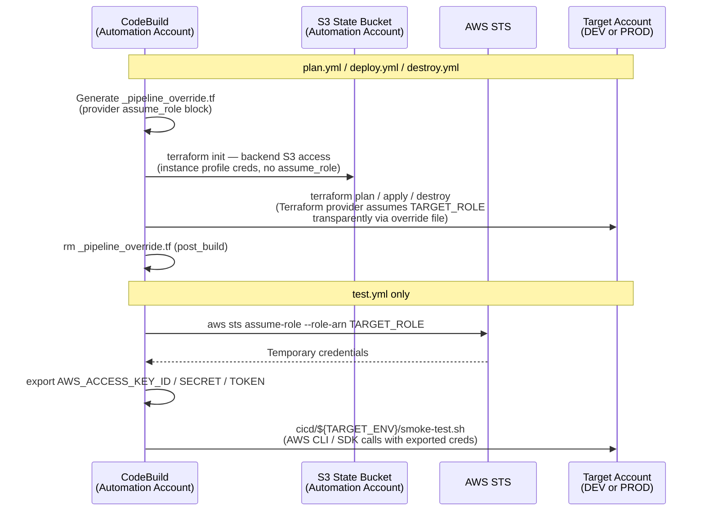
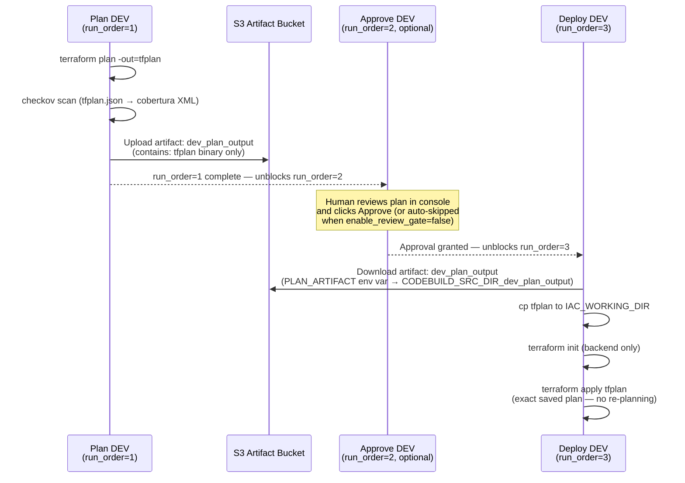
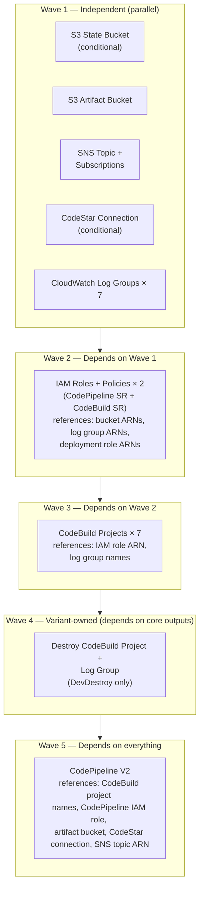
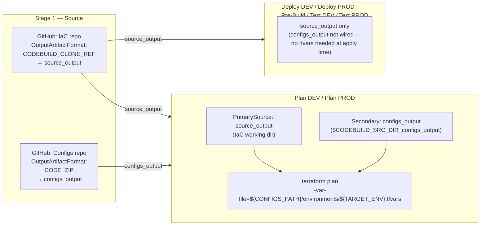

# Architecture and Design: Per-Environment Plan-Apply Pipeline

## Overview

This repository provides reusable Terraform modules that provision AWS CodePipeline V2 + CodeBuild CI/CD pipelines for deploying Terraform (or OpenTofu) infrastructure across a multi-account AWS Control Tower environment. Each pipeline instance is 1:1 with a Terraform project.

The pipeline follows a **per-environment plan-apply** model: each environment (DEV, PROD) is a consolidated pipeline stage containing ordered actions — Plan (with environment-specific tfvars and real state), optional Approval, and Deploy (from saved plan). This guarantees that the plan reviewed is exactly the plan applied.

The authoritative requirements are in `prd.md`. The original refinement analysis is in `docs/REFINEMENT_1.md`. The original MVP scope is in `docs/shared/codepipeline-mvp-statement.md`.

```mermaid
graph TB
    subgraph GitHub
        IaCRepo["IaC Repository
(Terraform/OpenTofu code)"]
        ConfigsRepo["Configs Repository
(optional: tfvars files)"]
    end

    subgraph AutoAccount["Automation Account"]
        CP["AWS CodePipeline V2"]
        CB["CodeBuild Projects ×7
(prebuild, plan-dev/prod,
deploy-dev/prod, test-dev/prod)"]
        S3S["S3 State Bucket
(Terraform state)"]
        S3A["S3 Artifact Bucket
(plan files, pipeline artifacts)"]
        SNS["SNS Topic
(approval notifications)"]
        CSC["CodeStar Connection
(GitHub OAuth)"]
        IAM["IAM Service Roles
(CodePipeline + CodeBuild)"]
    end

    subgraph DEVAccount["DEV Target Account"]
        DevRole["Deployment Role
(pre-existing prerequisite)"]
        DevResources["AWS Resources
(managed by Terraform)"]
    end

    subgraph PRODAccount["PROD Target Account"]
        ProdRole["Deployment Role
(pre-existing prerequisite)"]
        ProdResources["AWS Resources
(managed by Terraform)"]
    end

    IaCRepo -->|"push triggers pipeline"| CSC
    ConfigsRepo -->|"push triggers pipeline
(when configs_repo enabled)"| CSC
    CSC --> CP
    CP --> CB
    CP --> S3A
    CP -->|"approval request"| SNS
    CB -->|"state read/write
(instance profile creds)"| S3S
    CB -->|"assume role
(provider override file)"| DevRole
    CB -->|"assume role
(provider override file)"| ProdRole
    CB -->|"sts assume-role
(test.yml only)"| DevRole
    DevRole --> DevResources
    ProdRole --> ProdResources
    IAM --> CP
    IAM --> CB
```



### Variant Summary

| Variant | Module Source | Stages | Account Model | Use Case |
|---------|-------------|--------|---------------|----------|
| **Default** | `modules/default/` | 6 | 3 accounts (Automation + DEV + PROD) | Standard cross-account deployment. Also supports single-account when `dev_account_id == prod_account_id`. |
| **Default-DevDestroy** | `modules/default-dev-destroy/` | 7–8 | 3 accounts (Automation + DEV + PROD) | Cross-account with ephemeral DEV teardown after PROD success. |

## Module Architecture

### Shared Core + Overlay Pattern



```
┌─────────────────────────────────────────────────────────────────────┐
│                        Consumer Root Module                         │
│                                                                     │
│   module "pipeline" {                                               │
│     source = "modules/<variant>"   # default | default-dev-destroy  │
│     ...                                                             │
│   }                                                                 │
└───────────┬─────────────────────────────────────┬───────────────────┘
            │                                     │
            ▼                                     ▼
┌───────────────────────┐    ┌────────────────────────────────────────┐
│   Variant Wrapper     │    │   Variant Wrapper creates:             │
│   (e.g. default/)     │    │   - CodePipeline V2 (stage config)     │
│                       │    │   - Variant-specific resources         │
│   Calls core module   │    │     (e.g. destroy CodeBuild project)   │
└───────────┬───────────┘    └────────────────────────────────────────┘
            │
            ▼
┌───────────────────────────────────────────────────────────────────────┐
│                     Core Module (modules/core/)                       │
│                     Internal only — never called directly             │
│                                                                       │
│   Creates:                                                            │
│   - 2 IAM Roles + Policies (CodePipeline SR, CodeBuild SR)            │
│   - S3 State Bucket (conditional) + Artifact Bucket                   │
│   - SNS Approval Topic + Email Subscriptions                          │
│   - CodeStar Connection (conditional)                                 │
│   - 7 CloudWatch Log Groups (prebuild + 6 per-env)                    │
│   - 7 CodeBuild Projects (prebuild + 6 per-env)                       │
│                                                                       │
│   Outputs:                                                            │
│   - All resource ARNs, names, and IDs for variant wiring              │
└───────────────────────────────────────────────────────────────────────┘
```

### Resource Ownership

| Resource | Owner | Count | Notes |
|----------|-------|-------|-------|
| IAM Roles + Policies (x2) | Core | 2 | CodePipeline SR + CodeBuild SR |
| S3 State Bucket (conditional) | Core | 0-1 | Shared state storage |
| S3 Artifact Bucket | Core | 1 | Pipeline artifacts + plan files |
| SNS Approval Topic | Core | 1 | Approval notifications |
| CodeStar Connection (conditional) | Core | 0-1 | GitHub integration |
| CloudWatch Log Groups | Core | 7 | prebuild, plan-dev, plan-prod, deploy-dev, deploy-prod, test-dev, test-prod |
| CodeBuild Projects | Core | 7 | prebuild, plan-dev, plan-prod, deploy-dev, deploy-prod, test-dev, test-prod |
| CodePipeline V2 | Variant | 1 | Stage definitions are variant-specific |
| Destroy CodeBuild Project | Variant (DevDestroy only) | 0-1 | `<project>-destroy` + log group |

### Variables Interface

Variant wrappers (`modules/default/variables.tf`, `modules/default-dev-destroy/variables.tf`) are **identical copies** of `modules/core/variables.tf` — they are not thin pass-throughs. Every variable accepted by core is re-declared in the variant, and the variant passes all values through to the core module call. This means consumers see the same interface (30 or 31 variables) regardless of which variant they use. Maintainers adding variables to core must update all variant wrappers as well.

### CodeStar Connection First-Run Activation

When `codestar_connection_arn = ""` (the default), the module creates a new `aws_codestarconnections_connection` resource. AWS provisions this in `PENDING` state — it cannot be used by the pipeline until a one-time **manual OAuth authorization** is completed in the AWS Console:

```
AWS Console → Developer Tools → Connections → <project-name>-github → Update pending connection
```

The pipeline will fail at the Source stage with a permissions error until this step is completed. This is a one-time step per connection. If reusing an existing `AVAILABLE` connection across pipelines, pass its ARN via `codestar_connection_arn` to skip creation entirely.

### Core Module Outputs

| Output | Type | Purpose |
|--------|------|---------|
| `codebuild_project_names` | `map(string)` | Keys: prebuild, plan-dev, plan-prod, deploy-dev, deploy-prod, test-dev, test-prod |
| `codebuild_service_role_arn` | `string` | For variant-created CodeBuild projects (destroy) |
| `codepipeline_service_role_arn` | `string` | For CodePipeline resource |
| `artifact_bucket_name` | `string` | For CodePipeline artifact store |
| `state_bucket_name` | `string` | Pass-through to consumer |
| `sns_topic_arn` | `string` | For approval actions |
| `codestar_connection_arn` | `string` | For source stage action |
| `log_group_arns` | `map(string)` | Log group ARNs for reference |
| `pipeline_url_prefix` | `string` | AWS Console URL prefix for pipeline URLs |
| `project_name` | `string` | Project name pass-through |
| `dev_account_id` | `string` | DEV account ID pass-through |
| `prod_account_id` | `string` | PROD account ID pass-through |
| `all_tags` | `map(string)` | Merged tags for variant-owned resources |
| `configs_enabled` | `bool` | Whether the configs repo feature is active (true when `configs_repo` is non-empty) |
| `configs_repo_connection_arn` | `string` | Resolved CodeStar Connection ARN for the configs repo (deduped; falls back to IaC repo connection) |

## Variant Architectures

### Default Variant (6 Stages)



### Default-DevDestroy Variant (7-8 Stages)

Stages 1-6 identical to Default. Adds:
- Stage 7 (optional): Destroy Approval — controlled by `enable_destroy_approval` (default: `true`)
- Stage 7/8: Destroy DEV — `terraform destroy` against DEV state via cross-account role



### Cross-Account Credential Flow

```
Automation Account (pipeline host)
└── CodeBuild-<project>-ServiceRole (shared by all 7 projects)
    ├── Instance profile credentials (never overwritten) → S3 state bucket access
    └── Provider assume_role (via _pipeline_override.tf) →
        ├── DEV deployment role  → terraform plan/apply/destroy (provider operations)
        └── PROD deployment role → terraform plan/apply (provider operations)
```

**Provider override credential model:** Buildspecs generate a `_pipeline_override.tf` file at runtime containing `provider "aws" { assume_role { ... } }`. Terraform override files merge with the developer's existing provider block, adding cross-account role assumption without modifying developer code.

- **State operations** (S3 reads/writes, locking) — use the CodeBuild service role's instance profile credentials directly. No `assume_role` in backend config, no `export AWS_*` to overwrite them.
- **Provider operations** (AWS API calls to manage resources) — use the target account deployment role via the provider's `assume_role` attribute, injected by the override file.

The override file is generated via `cat <<'EOF'` + `envsubst` to expand `${TARGET_ROLE}` and `${TARGET_ENV}`, then cleaned up in `post_build`. No STS assume-role calls or exported credentials in buildspecs.

Plan and Deploy actions for the same environment use the same cross-account deployment role via the override file. Plan needs read access for accurate diffs; Deploy needs write access for apply.

**Credential strategy by buildspec:**

| Buildspec | Credential Mechanism | Reason |
|-----------|----------------------|--------|
| `plan.yml` | Provider override file (`_pipeline_override.tf`) — no STS calls, no `export AWS_*` | Terraform provider handles assumption transparently; S3 backend uses instance profile directly |
| `deploy.yml` | Provider override file (`_pipeline_override.tf`) — same as plan | Identical approach for apply; backend also uses instance profile |
| `destroy.yml` | Provider override file (`_pipeline_override.tf`) — same as plan/deploy | Destroy is a Terraform operation, same credential model |
| `test.yml` | Explicit `aws sts assume-role` + `export AWS_ACCESS_KEY_ID/SECRET/TOKEN` | Developer smoke-test scripts call AWS APIs directly (not via Terraform), so real credentials must be injected into the shell environment |
| `prebuild.yml` | Instance profile only (no assumption) | Prebuild runs in the Automation Account context; no cross-account access needed |

The `test.yml` approach is the exception: because developer-managed smoke-test scripts invoke AWS CLI or SDKs directly, the CodeBuild shell environment must have credentials for the target account exported as standard `AWS_*` variables before the script runs.



## Repository Structure

```
terraform-pipelines/
├── modules/
│   ├── core/                          # Internal shared module
│   │   ├── main.tf                    # CodeBuild projects (x7) + CloudWatch log groups (x7) via for_each
│   │   ├── iam.tf                     # IAM roles + policies (CodePipeline SR, CodeBuild SR)
│   │   ├── storage.tf                 # S3 buckets, SNS topic, subscriptions
│   │   ├── codestar.tf                # CodeStar Connection (conditional)
│   │   ├── variables.tf               # All inputs needed by core resources
│   │   ├── outputs.tf                 # All resource references for variant wrappers
│   │   ├── locals.tf                  # Computed values including project config map
│   │   ├── versions.tf                # Terraform >= 1.11, AWS ~> 6.0
│   │   └── buildspecs/               # Shared buildspec files
│   │       ├── prebuild.yml
│   │       ├── plan.yml               # Per-env plan + security scan
│   │       ├── deploy.yml             # Apply from saved plan
│   │       └── test.yml
│   │
│   ├── default/                       # Default variant wrapper
│   │   ├── main.tf                    # module "core" + CodePipeline (6 stages)
│   │   ├── variables.tf               # Uniform interface
│   │   ├── outputs.tf                 # Uniform outputs
│   │   └── versions.tf
│   │
│   └── default-dev-destroy/           # Default-DevDestroy variant wrapper
│       ├── main.tf                    # module "core" + CodePipeline (7-8 stages) + destroy project
│       ├── variables.tf               # Uniform interface + enable_destroy_approval
│       ├── outputs.tf                 # Uniform outputs
│       ├── versions.tf
│       └── buildspecs/
│           └── destroy.yml            # Variant-specific destroy buildspec
│
├── examples/
│   ├── default/
│   │   ├── minimal/
│   │   ├── complete/
│   │   ├── opentofu/
│   │   ├── single-account/
│   │   └── configs-repo/              # Default variant with configs repo feature
│   ├── default-dev-destroy/
│   │   └── minimal/
│   └── cicd/                          # Developer-managed script templates (copy to your repo)
│       ├── prebuild/main.sh
│       ├── dev/smoke-test.sh
│       └── prod/smoke-test.sh
│
├── tests/
│   ├── test-terraform.sh              # Validation + E2E deploy script (7 gates)
│   ├── default/                       # Default variant E2E test config
│   ├── default-dev-destroy/           # DevDestroy variant E2E test config
│   ├── default-configs/               # Default variant + configs repo E2E test config
│   └── default-dev-destroy-configs/   # DevDestroy + configs repo E2E test config
│
├── docs/
│   ├── ARCHITECTURE_AND_DESIGN.md     # This file
│   ├── REFINEMENT_1.md                # Historical: refinement analysis
│   ├── shared/
│   │   ├── codepipeline-mvp-statement.md
│   │   └── diagrams/
│   ├── default/
│   ├── default-dev-destroy/
│   └── configs-repo/                  # Configs repo feature usage guide
│
├── CLAUDE.md
├── prd.md
├── CHANGELOG.md
└── progress.txt
```

## Buildspec Strategy

### Shared Buildspecs (core)

| Buildspec | Used By | Key Changes |
|-----------|---------|-------------|
| `prebuild.yml` | All variants (Stage 2) | Unchanged — not environment-specific |
| `plan.yml` | All variants (DEV + PROD stages, Plan action) | Rewritten: cross-account role assumption, per-env state, tfvars, integrated Checkov |
| `deploy.yml` | All variants (DEV + PROD stages, Deploy action) | Rewritten: applies saved tfplan artifact instead of re-planning |
| `test.yml` | All variants (Test DEV + Test PROD stages) | Unchanged — already accepts TARGET_ENV |

### Variant-Specific Buildspecs

| Buildspec | Used By | Notes |
|-----------|---------|-------|
| `destroy.yml` | Default-DevDestroy only (Destroy DEV stage) | Unchanged — already targets DEV only |

### OpenTofu Compatibility

All runtime-installing buildspecs (`plan.yml`, `deploy.yml`, `destroy.yml`) use a unified compatibility approach:

```bash
if [ "${IAC_RUNTIME}" = "opentofu" ]; then
  # Install OpenTofu
  curl -fsSL https://get.opentofu.org/install-opentofu.sh | sh -s -- --install-method standalone
  # Create symlink so all subsequent commands use "terraform" unchanged
  ln -sf /usr/local/bin/tofu /usr/local/bin/terraform
else
  # Install Terraform normally
fi
terraform --version   # works regardless of runtime
```

When `iac_runtime = "opentofu"`, OpenTofu is installed and a symlink `terraform → tofu` is created at `/usr/local/bin/terraform`. Every subsequent command in the buildspec (`terraform init`, `terraform plan`, `terraform apply`) transparently invokes OpenTofu via this alias. No conditional branching is needed after the install phase. The `terraform` binary name remains consistent across all pipeline stages regardless of the configured runtime.

### plan.yml Flow

```
INSTALL:
  - Install IaC runtime (terraform or opentofu)
  - Install Checkov (if ENABLE_SECURITY_SCAN=true)

BUILD:
  - cd to IAC_WORKING_DIR (anchored to CODEBUILD_SRC_DIR)
  - Assume cross-account role (TARGET_ROLE)
  - terraform init with real env state (${STATE_KEY_PREFIX}/${TARGET_ENV}/terraform.tfstate)
  - terraform plan -out=tfplan [-var-file=environments/${TARGET_ENV}.tfvars]
  - If ENABLE_SECURITY_SCAN=true:
    - terraform show -json tfplan > tfplan.json
    - set +e; checkov scan on tfplan.json (--output cli --output json --output-file-path /tmp/checkov)
      - CLI output → CloudWatch Logs (unchanged build log)
      - JSON output → /tmp/checkov/results_json.json
    - CHECKOV_EXIT=$?; set -e   (exit code captured before converter runs)
    - rm -f tfplan.json
    - Python converter (inline heredoc): results_json.json → /tmp/checkov/checkov-cobertura.xml
      - One <class> per Terraform resource; one <line> per check (hits=1 passed, hits=0 failed)
      - line-rate = passed / (passed + failed); defaults to 1.0 when zero checks
      - Skipped checks excluded from coverage calculation
    - exit ${CHECKOV_EXIT}  (re-raises after converter; preserves hard/soft-fail behaviour)

ARTIFACTS:
  - tfplan (consumed by Deploy action)

REPORTS (static buildspec directive — always present):
  - checkov-security: /tmp/checkov/checkov-cobertura.xml (COBERTURAXML)
    → CodeBuild uploads to report group {project_name}-plan-{env}-checkov-security (auto-created)
    → When ENABLE_SECURITY_SCAN=false the file is absent; CodeBuild logs a warning, build continues
```

### deploy.yml Flow

```
INSTALL:
  - Install IaC runtime (terraform or opentofu)

PRE_BUILD:
  - Locate saved plan via PLAN_ARTIFACT environment variable:
      PLAN_DIR_VAR="CODEBUILD_SRC_DIR_${PLAN_ARTIFACT}"
      PLAN_DIR="${!PLAN_DIR_VAR}"          # bash indirect expansion
      cp "${PLAN_DIR}/tfplan" "${CODEBUILD_SRC_DIR}/${IAC_WORKING_DIR}/tfplan"

BUILD:
  - cd to IAC_WORKING_DIR (anchored to CODEBUILD_SRC_DIR)
  - Generate _pipeline_override.tf (cross-account role assumption)
  - terraform init with real env state
  - terraform apply tfplan (the plan copied in pre_build)
```

**PLAN_ARTIFACT mechanism:** The CodePipeline action passes the plan artifact name to CodeBuild via an environment variable override `PLAN_ARTIFACT` (e.g., `dev_plan_output` or `prod_plan_output`). CodeBuild exposes secondary input artifacts at `$CODEBUILD_SRC_DIR_<artifactName>`. The buildspec uses bash indirect variable expansion (`${!PLAN_DIR_VAR}`) to dynamically construct the correct path at runtime. This allows the single `deploy.yml` buildspec to be reused for both DEV and PROD deployments without hardcoding artifact names.

## Checkov Coverage Reporting

When `enable_security_scan = true`, each Plan build automatically generates a CodeBuild code
coverage report from the Checkov results. The report is visible in the CodeBuild console under
the **Reports** tab for `plan-dev` and `plan-prod` projects, with a line-coverage percentage
and historical trend graph across pipeline runs.

### Cobertura XML Mapping

Checkov results are converted to Cobertura XML format by an inline Python script embedded in
`plan.yml`. The mapping is:

| Cobertura Element | Checkov Meaning |
|---|---|
| `<package name="terraform-plan">` | One package per scan (the entire plan) |
| `<class name="aws_s3_bucket.main">` | One Terraform resource |
| `<line hits="1">` | A check that passed on this resource |
| `<line hits="0">` | A check that failed on this resource |
| Line coverage % | `passed / (passed + failed)` across all resources |

Skipped checks are excluded from both numerator and denominator. When zero checks apply,
`line-rate` defaults to `1.0` rather than dividing by zero.

### Report Group Naming

CodeBuild auto-creates the report group on the first build upload using the convention
`{codebuild-project-name}-{key-in-reports-section}`. With project names
`{project_name}-plan-dev` and `{project_name}-plan-prod` and the buildspec key
`checkov-security`, the auto-created groups are:

- `{project_name}-plan-dev-checkov-security`
- `{project_name}-plan-prod-checkov-security`

Both names match the existing IAM wildcard `{project_name}-*` in the `CodeBuildReports`
statement — no IAM changes were required to enable this feature.

### Behaviour by Configuration

| Condition | Outcome |
|---|---|
| `enable_security_scan=true`, checks pass | Report uploaded; build succeeds |
| `enable_security_scan=true`, checks fail, `checkov_soft_fail=true` (DEV) | Report uploaded; build succeeds |
| `enable_security_scan=true`, checks fail, PROD or `checkov_soft_fail=false` | Report uploaded; build fails (exit code re-raised after converter) |
| `enable_security_scan=false` | No file created; CodeBuild logs a non-fatal warning; build succeeds |

The coverage report is always uploaded before the Checkov exit code is re-raised, so even
hard-failing PROD builds produce a report that operators can inspect in the console.

### IAM Permissions

The `CodeBuildReports` statement in `modules/core/iam.tf` was pre-existing and covers all
five required actions scoped to `arn:aws:codebuild:{region}:{account}:report-group/{project_name}-*`:

```
codebuild:CreateReportGroup
codebuild:CreateReport
codebuild:UpdateReport
codebuild:BatchPutTestCases
codebuild:BatchPutCodeCoverages
```

`BatchPutTestCases` is included alongside `BatchPutCodeCoverages` following the AWS-recommended
policy pattern. It enables a future JUnit test report without an IAM change (see Post-MVP
Enhancements).

### Encryption

Auto-created report groups use SSE-S3 encryption by default (not CMK), consistent with the
module-wide CMK deferral policy. Consumers enforcing the
`CODEBUILD_REPORT_GROUP_ENCRYPTED_AT_REST` AWS Config rule will see these groups flagged as
NON_COMPLIANT. The remediation is to add an explicit `aws_codebuild_report_group` Terraform
resource with a KMS key ARN (see Post-MVP Enhancements). Note: `export_config.s3_destination.encryption_key`
is a **required** argument in the AWS provider when `export_config.type = "S3"` — a KMS ARN
must be supplied; there is no SSE-S3-only path through this argument.

## Core Module — for_each Design

The 7 CodeBuild projects and 7 CloudWatch log groups are created via `for_each` over a local configuration map. This eliminates repetitive resource blocks while maintaining clear per-project configuration.

### Project Configuration Map

```hcl
locals {
  codebuild_projects = {
    prebuild = {
      description = "Pre-build stage"
      buildspec   = file("${path.module}/buildspecs/prebuild.yml")
      env_vars    = { PROJECT_NAME = var.project_name, IAC_RUNTIME = var.iac_runtime, IAC_VERSION = var.iac_version }
    }
    plan-dev = {
      description = "Plan DEV environment"
      buildspec   = file("${path.module}/buildspecs/plan.yml")
      env_vars    = {
        PROJECT_NAME        = var.project_name
        IAC_RUNTIME         = var.iac_runtime
        IAC_VERSION         = var.iac_version
        IAC_WORKING_DIR     = var.iac_working_directory
        STATE_BUCKET        = local.state_bucket_name
        STATE_KEY_PREFIX    = local.state_key_prefix
        TARGET_ENV          = "dev"
        TARGET_ROLE         = var.dev_deployment_role_arn
        ENABLE_SECURITY_SCAN = tostring(var.enable_security_scan)
        CHECKOV_SOFT_FAIL   = tostring(var.checkov_soft_fail)
      }
    }
    plan-prod = {
      description = "Plan PROD environment"
      buildspec   = file("${path.module}/buildspecs/plan.yml")
      env_vars    = {
        # ... same as plan-dev but:
        TARGET_ENV        = "prod"
        TARGET_ROLE       = var.prod_deployment_role_arn
        CHECKOV_SOFT_FAIL = "false"  # PROD always hard-fails
      }
    }
    deploy-dev = {
      description = "Deploy to DEV environment"
      buildspec   = file("${path.module}/buildspecs/deploy.yml")
      env_vars    = {
        # ... TARGET_ENV = "dev", TARGET_ROLE = var.dev_deployment_role_arn, state config ...
      }
    }
    deploy-prod = { ... }  # TARGET_ENV = "prod"
    test-dev    = { ... }  # TARGET_ENV = "dev"
    test-prod   = { ... }  # TARGET_ENV = "prod"
  }
}
```

### Resource Iteration

```hcl
resource "aws_cloudwatch_log_group" "this" {
  for_each          = local.codebuild_projects
  name              = "/codebuild/${var.project_name}-${each.key}"
  retention_in_days = var.log_retention_days
  tags              = local.all_tags
}

resource "aws_codebuild_project" "this" {
  for_each       = local.codebuild_projects
  name           = "${var.project_name}-${each.key}"
  description    = each.value.description
  service_role   = aws_iam_role.codebuild.arn
  build_timeout  = var.codebuild_timeout_minutes
  # ... environment variables from each.value.env_vars
  # ... logs_config referencing aws_cloudwatch_log_group.this[each.key]
}
```

## Input Variable Validation

Core module variables include runtime Terraform `validation` blocks that fail at `terraform plan` with descriptive error messages. These enforce correctness before any resources are created:

| Variable | Constraint | Rule |
|----------|-----------|------|
| `project_name` | Regex `^[a-z][a-z0-9-]{1,28}[a-z0-9]$` | 3–30 chars, lowercase alphanumeric start/end, hyphens allowed |
| `project_name` | Second validation | No consecutive hyphens (S3 bucket naming compliance) |
| `github_repo` | Regex `^[A-Za-z0-9_.-]+/[A-Za-z0-9_.-]+$` | Must be `org/repo` format |
| `dev_account_id` | Regex `^[0-9]{12}$` | Exactly 12 digits |
| `prod_account_id` | Regex `^[0-9]{12}$` | Exactly 12 digits |
| `dev_deployment_role_arn` | Regex `^arn:aws:iam::[0-9]{12}:role/.+$` | Valid IAM role ARN format |
| `prod_deployment_role_arn` | Regex `^arn:aws:iam::[0-9]{12}:role/.+$` | Valid IAM role ARN format |
| `codestar_connection_arn` | Empty or valid ARN regex | Accepts both `codestar-connections` and `codeconnections` service names |
| `codebuild_compute_type` | `contains([...])` | Must be `BUILD_GENERAL1_SMALL/MEDIUM/LARGE` |
| `codebuild_image` | Prefix `^aws/codebuild/` | Enforces AWS-managed images only (no custom Docker) |
| `codebuild_timeout_minutes` | Range 5–480 | CodeBuild service limits |
| `log_retention_days` | `contains([1,3,5,7,14,30,60,...,3653])` | Restricted to CloudWatch Logs–allowed values |
| `artifact_retention_days` | Range 1–365 | S3 lifecycle constraint |
| `iac_runtime` | `contains(["terraform","opentofu"])` | Mutually exclusive runtimes |
| `configs_repo` | Empty or `org/repo` regex | When non-empty, must match repo format |
| `configs_repo_branch` | `length > 0` | Non-empty branch name |
| `configs_repo_path` | Three validations | Must be `"."` or relative path; no `..`; no leading slash |
| `configs_repo_codestar_connection_arn` | Empty or valid ARN regex | Same format as `codestar_connection_arn` |

## Artifact Flow Detail

### Within a Consolidated Environment Stage

```
┌─────────────────────────────────────────────────────────────┐
│ Stage: DEV                                                  │
│                                                             │
│  ┌──────────────┐    ┌──────────────┐    ┌──────────────┐   │
│  │ Plan DEV     │    │ Approve DEV  │    │ Deploy DEV   │   │
│  │ run_order=1  │───►│ run_order=2  │───►│ run_order=3  │   │
│  │              │    │ (optional)   │    │              │   │
│  │ output:      │    │              │    │ input:       │   │
│  │ dev_plan_out │    │ BLOCKS until │    │ dev_plan_out │   │
│  └──────────────┘    │ approved     │    └──────────────┘   │
│                      └──────────────┘                       │
└─────────────────────────────────────────────────────────────┘
```

The Plan action's `output_artifacts` produces `dev_plan_output` containing the `tfplan` file. The Deploy action's `input_artifacts` consumes `dev_plan_output`. The Approval action (when present) blocks between them.



### Plan Artifact Contents

The plan artifact contains only the `tfplan` binary file. The `tfplan.json` and `checkov-cobertura.xml` are consumed within the Plan action and not passed downstream.

```yaml
# plan.yml artifacts section
artifacts:
  files:
    - tfplan
  base-directory: "${IAC_WORKING_DIR}"  # or CODEBUILD_SRC_DIR/IAC_WORKING_DIR
  discard-paths: "yes"
```

## Security Model

### Checkov Scan Policy

| Environment | `enable_security_scan=true` | `checkov_soft_fail=true` | `checkov_soft_fail=false` |
|-------------|---------------------------|-------------------------|--------------------------|
| DEV | Scan runs, soft-fail (advisory) | Scan runs, soft-fail | Scan runs, hard-fail |
| PROD | Scan runs, **always hard-fail** | Scan runs, **always hard-fail** | Scan runs, hard-fail |

When `enable_security_scan=false`, neither environment runs the Checkov scan.

### Encryption

- S3 artifact bucket: SSE-S3 (AES256) encryption, SSL-only bucket policy, Block Public Access enabled
- S3 state bucket: SSE-S3 (AES256) encryption, versioning enabled, SSL-only bucket policy
- Plan artifacts (tfplan files): same SSE-S3 protection as all pipeline artifacts
- SNS topic: encrypted using `alias/aws/sns` (AWS-managed SNS KMS key — **not** a customer-managed CMK). Consumers with CMK compliance requirements (e.g., requiring customer-controlled key rotation or cross-account key policies) must bring their own SNS topic ARN via a future variable.
- CodeBuild coverage report groups: SSE-S3 (auto-created default); CMK upgrade requires explicit `aws_codebuild_report_group` resource (post-MVP, see Checkov Coverage Reporting section)

### Artifact Lifecycle

The artifact bucket has an S3 lifecycle configuration applied:

- **Object expiry**: All objects expire after `artifact_retention_days` days (default: 30, range: 1–365)
- **Incomplete multipart uploads**: Aborted after 7 days regardless of `artifact_retention_days`

The state bucket intentionally has **no** object expiry — all state file versions are retained indefinitely for rollback and audit purposes.

### IAM Least Privilege

- CodeBuild service role: scoped to specific deployment role ARNs, specific S3 buckets, specific log groups
- CodePipeline service role: scoped to specific CodeBuild projects, specific S3 buckets, specific SNS topics
- Cross-account deployment roles: pre-existing, not managed by pipeline

## Design Decisions

| # | Decision | Rationale |
|---|----------|-----------|
| 1 | Per-environment plan-apply flow | Guarantees the plan reviewed is the plan applied. Eliminates drift between review and deploy. |
| 2 | Consolidated stages with run_order | Reduces stage count (9→6). Each environment is a logical unit. Approval action blocks deploy within the same stage. |
| 3 | Deploy re-initializes then applies plan | Plan artifact carries only tfplan file (small). Deploy runs terraform init independently for clean backend setup. Avoids large artifacts with .terraform directory. |
| 4 | for_each for CodeBuild projects + log groups | 7 projects defined via local config map instead of 7 repetitive resource blocks. Easier to maintain and extend. |
| 5 | Per-environment CodeBuild projects | Required for per-environment CloudWatch log groups. Log group is set on the project, not per build invocation. |
| 6 | Core loads its own buildspecs | Core uses `file("${path.module}/buildspecs/...")`. Variants that need different buildspecs (destroy) create their own projects outside core. Keeps core interface clean. |
| 7 | One shared CodeBuild IAM service role | All 7 projects share one role. Same permissions needed (STS AssumeRole to both DEV and PROD deployment roles). No benefit to separate roles. |
| 8 | PROD Checkov always hard-fails | `checkov_soft_fail` controls DEV only. PROD security scan is never advisory. Prevents accidental production deployment with security findings. |
| 9 | `enable_security_scan` defaults to true | Secure by default. Consumers opt out explicitly. |
| 10 | `enable_review_gate` repurposed for DEV | PROD approval is always mandatory. The existing toggle now controls the optional DEV approval action within the DEV stage. |
| 11 | Remove throwaway plan state path | The `plan/terraform.tfstate` path served no purpose beyond initializing providers for the old environment-agnostic plan. Per-env plans use real state. |
| 12 | Always proceed on empty plan | Even with zero changes, pipeline runs through Approve and Deploy (apply is a no-op). Avoids custom logic to signal downstream actions. Consistent flow. |
| 13 | No moved blocks | Clean implementation without migration baggage. |
| 14 | Artifact contains tfplan only | Deploy needs only the saved plan. JSON and Checkov report are consumed within the Plan action. Smaller artifact. |
| 15 | Keep current file layout | main.tf (CodeBuild + logs), iam.tf, storage.tf, codestar.tf. Minimal diff, familiar structure. |
| 16 | Provider override file for cross-account access | Buildspecs generate `_pipeline_override.tf` at runtime with `provider "aws" { assume_role { ... } }`. Terraform merges this with the developer's provider block, injecting cross-account role assumption transparently. No `aws sts assume-role` or `export AWS_*` in buildspecs. |
| 17 | Instance profile credentials for S3 backend | CodeBuild service role instance profile credentials handle S3 state access directly. No `assume_role` in backend config, no self-assumption needed. Simpler trust policy (only `codebuild.amazonaws.com`). |
| 18 | envsubst for override file generation | Override file written with `cat <<'EOF'` (no shell expansion) then `envsubst` expands `${TARGET_ROLE}` and `${TARGET_ENV}`. Cleanup via `rm -f` in `post_build`. |
| 19–30 | Original design decisions preserved | See `docs/shared/` for decisions from the original architecture (encryption, conditional resources, validation, tags, etc.) |
| 31 | Checkov results surfaced as CodeBuild code coverage report (Cobertura XML) | Structured per-resource, per-check visibility in the CodeBuild console with a line-rate percentage and historical trend graph. Single `plan.yml` change; no new Terraform resources or consumer variables. See the Checkov Coverage Reporting section for the full design. |

## Dependency Graph

### Resource Creation Order



## Test Environment

To run E2E tests, you need three AWS accounts with cross-account deployment roles:

| Account | Purpose |
|---------|---------|
| Automation | Pipeline host — all pipeline resources deployed here |
| DEV Target | DEV deployment target |
| PROD Target | PROD deployment target |

Four test configurations exist, one per variant + feature combination:

| Test Directory | Variant + Feature | `--deploy` target |
|----------------|-------------------|-------------------|
| `tests/default/` | Default | `--deploy default` |
| `tests/default-dev-destroy/` | Default-DevDestroy | `--deploy default-dev-destroy` |
| `tests/default-configs/` | Default + configs repo | `--deploy default-configs` |
| `tests/default-dev-destroy-configs/` | DevDestroy + configs repo | `--deploy default-dev-destroy-configs` |

Configure test values in `tests/<variant>/terraform.tfvars` (copy from `terraform.tfvars.example`). Set `AWS_PROFILE` to the Automation Account CLI profile before running `--deploy`.

### Validation Gates

`tests/test-terraform.sh` runs 7 sequential gates. Gates 1–3 are hard-fail (non-zero exit terminates the script). Gates 4–6 are advisory (findings are printed as warnings but do not fail the run). Gate 7 is hard-fail and only runs with `--deploy`.

| Gate | Tool | Scope | On Failure |
|------|------|-------|------------|
| 1. git-secrets | git-secrets | All files in repo | Hard-fail (exit 1) |
| 2. fmt | `terraform fmt -check -recursive` | All HCL in repo root | Hard-fail (exit 2) |
| 3. init+validate | `terraform init -backend=false` + `validate` | All modules, examples, and tests dirs | Hard-fail (exit 3) |
| 4. tflint | tflint | Modules only | Advisory (warning, continues) |
| 5. checkov | checkov | Modules only | Advisory (warning, continues) |
| 6. trivy | trivy `--severity HIGH,CRITICAL` | Modules only | Advisory (warning, continues) |
| 7. plan+apply | `terraform plan -out=tfplan` + `apply tfplan` | `tests/<deploy-target>/` | Hard-fail (exit non-zero) |

Gates 5 and 6 are skipped entirely when `--skip-security` is passed. Gate 7 only runs when `--deploy <name>` is specified; without it, a "skipped" notice is printed and the script exits successfully. Tools that are not installed are skipped with a warning (git-secrets, tflint, checkov, trivy) — terraform is required and causes an immediate hard-fail if absent.

## Out of Scope

| Item | Rationale |
|------|-----------|
| Deployment roles in target accounts | Prerequisite. Not managed by pipeline. |
| Custom Docker images | Standard images + inline install. |
| More than two environments | Each pipeline deploys to DEV and PROD only. |
| Core module as public API | Consumers must use variant wrappers. |
| Customer-managed KMS keys | SSE-S3 sufficient for artifact encryption. |
| Empty plan short-circuiting | Always proceed through Approve and Deploy. |
| Migration tooling / moved blocks | Not needed — clean implementation. |

## Post-MVP Enhancements

Known deferred improvements for future implementation:

| Enhancement | Area | Description |
|---|---|---|
| `aws_codebuild_report_group` Terraform resource | Coverage reporting | Explicit lifecycle management, S3 export, custom retention beyond 30 days, CMK encryption. Required for environments enforcing `CODEBUILD_REPORT_GROUP_ENCRYPTED_AT_REST` AWS Config rule. Must use `type = "CODE_COVERAGE"`. Note: `export_config.s3_destination.encryption_key` (KMS ARN) is **required** in the AWS provider when `export_config.type = "S3"` — there is no SSE-S3-only path through this argument. |
| S3 export retention alignment | Coverage reporting | Align report retention with the existing `artifact_retention_days` variable so reports survive beyond the 30-day CodeBuild default. |
| `json.JSONDecodeError` handling in converter | Coverage reporting | Wrap `json.load()` in `try/except json.JSONDecodeError` with a descriptive error message. Build fails safely today but shows a raw Python traceback in CloudWatch. |
| CloudWatch alarm on `FailedBuilds` | Operational Excellence | Add `aws_cloudwatch_metric_alarm` for `plan-dev` and `plan-prod` CodeBuild projects using the existing SNS approval topic. Module-wide gap, not specific to coverage reporting. |
| Coverage threshold gate | Coverage reporting | New variable `checkov_coverage_threshold` (0–100). Fail the build if line coverage falls below the threshold — after the Cobertura XML is written so the report remains visible on failed builds. |
| Skipped checks in Cobertura output | Coverage reporting | Include `skipped_checks` as a third line category rather than excluding them entirely from the coverage calculation. |
| JUnit XML test report | Coverage reporting | Upload `results_junitxml.xml` alongside the Cobertura file for per-check test case detail in the CodeBuild console. `BatchPutTestCases` IAM action is already present. |
| Checkov baseline file support | Coverage reporting | Allow a `.checkov.baseline` file to suppress known findings from the coverage calculation. |

## Configs Repo Feature

The configs repo feature allows `.tfvars` files to live in a dedicated repository, separate from the IaC repo. When enabled, plan and destroy actions source tfvars exclusively from the configs repo instead of the IaC repo. The pipeline triggers on push to either repository. This feature is entirely optional — when no configs repo is specified, the pipeline behaves identically to the base behavior.

### New Parameters

| Parameter | Type | Default | Description |
|-----------|------|---------|-------------|
| `configs_repo` | `string` | `""` | GitHub repository in `org/repo` format containing tfvars files. When empty, tfvars are sourced from the IaC repo (default behavior). |
| `configs_repo_branch` | `string` | `"main"` | Branch of the configs repo to track. |
| `configs_repo_path` | `string` | `"."` | Path within configs repo where the `environments/` directory is located. Must be `"."` or a relative path without `..`, leading/trailing slashes, or absolute paths. |
| `configs_repo_codestar_connection_arn` | `string` | `""` | CodeStar Connection ARN for the configs repo. When empty, reuses the IaC repo's connection. Must be provided when the configs repo is in a different GitHub organization. |

### Source Stage Changes

When `configs_repo` is non-empty, the Source stage gains a second `CodeStarSourceConnection` action alongside the existing IaC repo action:

```
Source stage (configs_repo enabled):
  Action 1: checkout IaC repo     → artifact: source_output   (unchanged)
  Action 2: checkout configs repo → artifact: configs_output  (new)
```

Both actions have `DetectChanges = "true"`, so the pipeline triggers on push to either repository. When `configs_repo = ""`, the Source stage is identical to the base implementation.

**Artifact format distinction:** The two source actions use different `OutputArtifactFormat` values by design:

| Action | Format | Reason |
|--------|--------|--------|
| IaC repo (`source_output`) | `CODEBUILD_CLONE_REF` | Full git clone — preserves commit history, branch refs, and git metadata needed for tools that introspect git context |
| Configs repo (`configs_output`) | `CODE_ZIP` | Archive only — configs repo is read-only configuration; no git metadata needed, and `CODE_ZIP` avoids the IAM `codeconnections:UseConnection` requirement for secondary sources in some connection types |

### Artifact Flow

Plan and Destroy actions receive `configs_output` as a secondary input artifact. CodeBuild exposes it at `$CODEBUILD_SRC_DIR_configs_output`. The `PrimarySource` is explicitly set to `source_output` (IaC repo) so the CodeBuild working directory defaults to the IaC source.

```
Plan-DEV / Plan-PROD / Destroy-DEV (configs enabled):
  input_artifacts: [source_output, configs_output]
  PrimarySource:   source_output

Deploy-DEV / Deploy-PROD / Test-DEV / Test-PROD / Pre-Build:
  unchanged — configs artifact not wired
```

Deploy and Test actions are not wired to the configs artifact. Deploy applies the saved `tfplan` binary (no tfvars resolution needed at apply time). Test scripts are developer-managed and unaffected.



### Buildspec Changes

`plan.yml` and `destroy.yml` use the `CONFIGS_ENABLED` and `CONFIGS_PATH` environment variables (baked into the CodeBuild project by core locals) to conditionally source tfvars:

```
When CONFIGS_ENABLED=true:
  Validate configs artifact directory exists and is non-empty (hard fail if missing)
  Resolve: ${CODEBUILD_SRC_DIR_configs_output}/${CONFIGS_PATH}/environments/${TARGET_ENV}.tfvars
  Path traversal prevention (see below)
  If file exists: pass -var-file to terraform plan/destroy
  If file missing: proceed without -var-file (graceful — same as base behavior)

When CONFIGS_ENABLED=false (or unset):
  Resolve: environments/${TARGET_ENV}.tfvars  (relative to IaC working directory)
  If file exists: pass -var-file to terraform plan/destroy
  If file missing: proceed without -var-file  (unchanged base behavior)
```

**Path traversal prevention:** When `CONFIGS_ENABLED=true`, the buildspec defends against `../` escape attacks in `CONFIGS_PATH`. After constructing the tfvars path, it uses `realpath -m` to fully resolve any symbolic path components, then validates the resolved absolute path stays within the configs artifact directory using a `case` statement:

```bash
CONFIGS_REAL=$(realpath -m "${CONFIGS_TFVARS}")
CONFIGS_DIR_REAL=$(realpath "${CODEBUILD_SRC_DIR_configs_output}")
case "${CONFIGS_REAL}" in
  "${CONFIGS_DIR_REAL}/"*) ;;  # safe — path is within artifact dir
  *) echo "ERROR: Resolved path is outside configs artifact directory." >&2; exit 1 ;;
esac
```

This is the runtime defence. The Terraform-level variable validation (`configs_repo_path` rejecting `..`, leading slashes, and absolute paths) is the plan-time defence — both layers work together.

`CONFIGS_ENABLED` defaults to `"false"` when unset, making manual CodeBuild triggers safe. `prebuild.yml`, `deploy.yml`, and `test.yml` are unchanged.

### IAM Policy

When the configs repo uses a different CodeStar Connection than the IaC repo, both ARNs are included in the `CodeStarConnectionAccess` IAM policy statements for both the CodePipeline and CodeBuild service roles. When both repos share the same connection, the policy is unchanged — a single ARN after `distinct()` deduplication.

### Known Limitations

1. **Toggle unsupported** — toggling `configs_repo` on/off on an existing pipeline may force-replace the CodePipeline resource due to the change in Source stage action count. This is a prerequisite decision before first deployment, not a runtime toggle.
2. **Shared configs repo triggers all referencing pipelines** — a push to a shared configs repo triggers every pipeline that references it, not only those whose `configs_repo_path` subtree changed. Use per-project paths (via `configs_repo_path`) to scope changes, but triggering is still repo-wide.
3. **Version skew risk** — because either repo push can trigger the pipeline independently, a coordinated IaC + config change may run with mismatched versions. Best practice: merge IaC changes first, then config changes.
4. **Execution mode** — the pipeline uses `SUPERSEDED` execution mode. A new trigger supersedes in-progress executions, which can cause partially-applied plans to be discarded.
5. **Cross-org connection not auto-detected** — if the configs repo is in a different GitHub organization, the consumer must explicitly provide `configs_repo_codestar_connection_arn`. The module does not detect or validate cross-org usage at plan time; the pipeline will fail at runtime with a CodeStar Connections error if the wrong connection is used.
